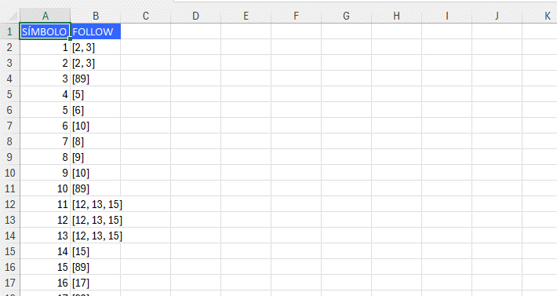
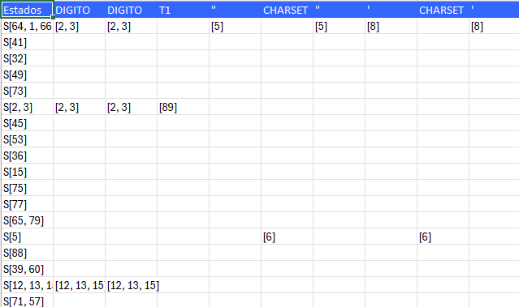

# Proyecto de Validación y Exportación de Expresiones Regulares

## Descripción
Este proyecto está diseñado para analizar y validar expresiones regulares, construir árboles de expresión, y exportar los resultados a archivos Excel. Adicionalmente, permite la validación de archivos TXT que contienen gramáticas y tokens definidos por el usuario.

## Estructura del Proyecto
El proyecto está compuesto por las siguientes clases principales:

- **ExpresionRegularToken.java**: Maneja los tokens en las expresiones regulares y calcula los conjuntos `first`, `last`, y `follow`.
- **ExpressionTreeExcelExporter.java**: Exporta los conjuntos `follow` a un archivo Excel.
- **ExpressionTreeParser.java**: Analiza expresiones regulares y construye un árbol de expresión.
- **ExpressionTreePrinter.java**: Proporciona una representación visual del árbol de expresión.
- **TreeNode.java**: Define los nodos en el árbol de expresión.
- **ValidacionDeExpresiones.java**: Valida la estructura de las expresiones en función de reglas gramaticales.
- **ValidadorGramatica.java**: Verifica que las gramáticas en los archivos cumplan con las estructuras definidas.

## Estructuras Utilizadas
- **Árbol de Expresión**: Representa la jerarquía de operadores y operandos en una expresión regular.
- **Mapas y Conjuntos**: Se utilizan para calcular y gestionar los conjuntos `first`, `last`, y `follow`.

## Entrada
- **ValidadorGramatica.java**: En esta clase se coloca el archivo.txt para proporcionar la gramatica generar las tablas.
- **Expresiones Regulares**: Se aceptan como cadenas o archivos TXT.
- **Archivos TXT**: Archivos con gramáticas y definiciones de tokens.

## Salidas
- **Árbol de Expresión**: Se puede visualizar el árbol generado a partir de una expresión regular.
- **Archivo Excel**: Exporta los resultados del análisis de las expresiones, como los conjuntos `follow`, a un archivo Excel.
- **Errores Detallados**: Si se encuentran errores en las expresiones o gramáticas, se reportan con la ubicación exacta (línea y columna).

## Requisitos del Sistema
- **Java 8+**
- Librería para manejar archivos Excel (ej. Apache POI)
- Herramienta de compilación como Maven o Gradle para gestionar dependencias

## Instrucciones de Uso

1. **Clonar el repositorio**:
   ```bash
   git clone <URL_DEL_REPOSITORIO>
   cd <NOMBRE_DEL_REPOSITORIO>
   ```

2. **Compilar el proyecto**:
   Si estás usando Maven:
   ```bash
   mvn clean install
   ```

3. **Ejecutar el programa**:
   ```bash
   java -jar target/nombre-del-archivo-jar.jar
   ```

4. **Proporcionar archivos de entrada**:
   Los archivos TXT con definiciones de gramáticas deben estar en el formato correcto para ser validados.

5. **Exportar a Excel**:
   Los resultados de la validación pueden ser exportados a Excel automáticamente.

## Conclusiones
1. **Eficiencia en la Validación**: El sistema es capaz de validar expresiones regulares y gramáticas de manera eficiente, permitiendo detectar errores rápidamente con información detallada sobre su ubicación en el archivo. Esto facilita la corrección de errores en grandes archivos de gramática.
   
2. **Árbol de Expresiones**: La implementación del árbol de expresiones facilita el análisis de las estructuras sintácticas de las expresiones regulares, lo que resulta útil en aplicaciones como compiladores o sistemas de procesamiento de lenguaje.

3. **Exportación a Excel**: La exportación de los resultados de los análisis a Excel ofrece una excelente manera de compartir y revisar los conjuntos de resultados generados por el sistema, lo cual puede ser útil en contextos académicos o empresariales.

4. **Modularidad del Código**: El diseño modular permite ampliar o modificar fácilmente el sistema para soportar nuevos tipos de validación, operadores adicionales o cambios en las reglas gramaticales.

## Recomendaciones
1. **Optimización de Memoria**: En futuras versiones, se recomienda optimizar el uso de memoria, especialmente al trabajar con archivos muy grandes o cuando se procesan gramáticas complejas que involucran muchos tokens y reglas.

2. **Soporte para Más Formatos de Salida**: Actualmente, los resultados se exportan a Excel. Sería recomendable agregar soporte para otros formatos como CSV, PDF o incluso bases de datos, según los requerimientos del usuario.

3. **Mejorar la Visualización del Árbol**: Para facilitar el análisis visual de las expresiones regulares, se puede integrar una interfaz gráfica que muestre el árbol de expresión de una manera más interactiva.

4. **Ampliar la Documentación**: Se recomienda ampliar la documentación interna del código para facilitar el mantenimiento y la colaboración entre desarrolladores. Esto incluye agregar más comentarios en el código y crear una guía de desarrollo.

5. **Pruebas Unitarias**: Implementar un conjunto robusto de pruebas unitarias para garantizar que el código funcione correctamente bajo diferentes escenarios y para simplificar el proceso de identificación de errores.

## Contribuciones
```
GARCÍA ELÍAS JOSÉ ANDRÉS         1106423
```
```
DE LA CRUZ GUEVARA MARIO RICARDO	1176323
```
```
RUANO LAM JUAN LUIS DANIEL	      1247723
```
```
XIQUIN CUMES OSCAR DANIEL	      1118423
```
# Manual de Usuario - Proyecto de Validación y Exportación de Expresiones Regulares

## Descripción
Este proyecto permite validar archivos de gramática y expresiones, construir árboles de expresión, y generar archivos Excel relacionados. Implementa una máquina de Moore que identifica y exporta los tokens derivados de las expresiones validadas.

## Requisitos
- **Java** (JDK 11 o superior)
- **Apache Maven**

## Instalación
1. Clona el repositorio:
   ```bash
   git clone <URL_DEL_REPOSITORIO>
   cd Proyecto_1_LF
   ```

2. Compila el proyecto:
   ```bash
   mvn clean install
   ```

## Uso
### Validación de Gramática
1. Carga un archivo con la gramática que deseas validar.


3. Si la gramática es válida, el programa generará automáticamente los archivos Excel con los conjuntos `follow`.



### Ingreso de Expresiones
- Una vez validada la gramática, ingresa expresiones (por ejemplo, `hola mundo =`) para que la máquina de Moore las procese y devuelva los tokens identificados.
  
   
## Exportación de Resultados
Los tokens generados y otros resultados de la validación se exportarán a archivos Excel para análisis posterior.

   

## Ejemplo
```bash
java -jar target/proyecto-gramatica.txt
```
- **Entrada de gramática**: archivo de texto estructurado.
- **Entrada de expresiones**: expresiones de prueba para validar.

---


